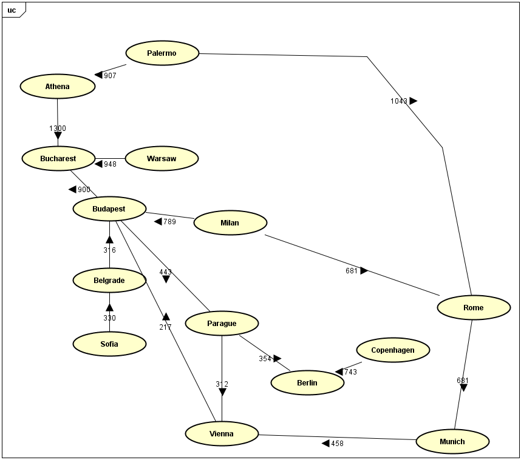
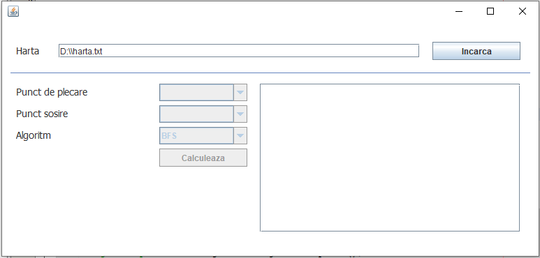
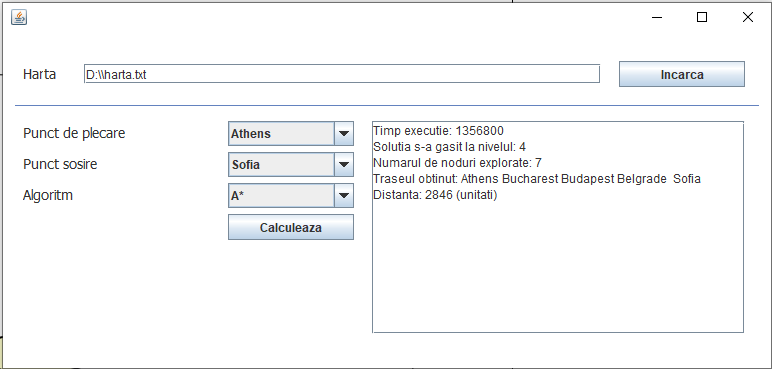

# Gasirea unui traseu intre 2 orase

### Cuprins

- Descriere
- Tehnologii
- Cum functioneaza

## Descriere

Se doreste gasirea unui traseu, dandu-se 2 puncte pe harta.

## Tehnologii
- Limbajul Java

## Algoritmi implementati
- Breadth first search
- Depth first search
- A*
- Greedy best first search

## Cum functioneaza

Utilizatorul trebuie sa introduca calea unui fiser txt si sa selecteze din controalele afisate.

### Harta pentru fisierul txt *(caile bidirectionale)

### Imagini in timpul rularii

